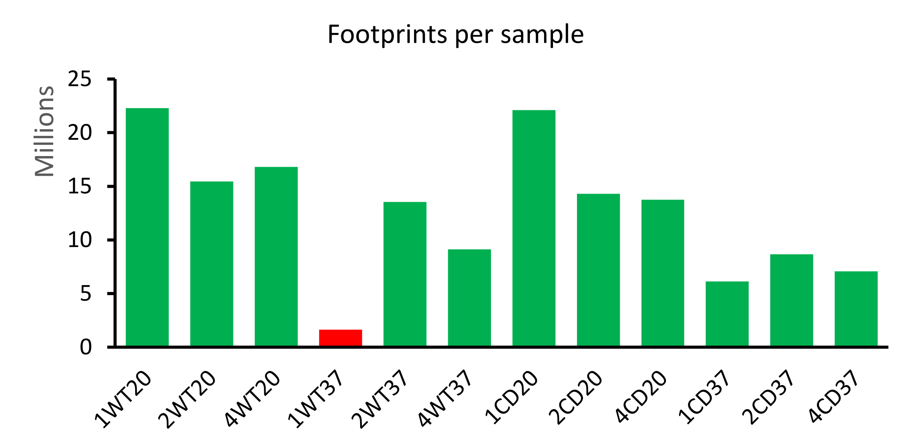
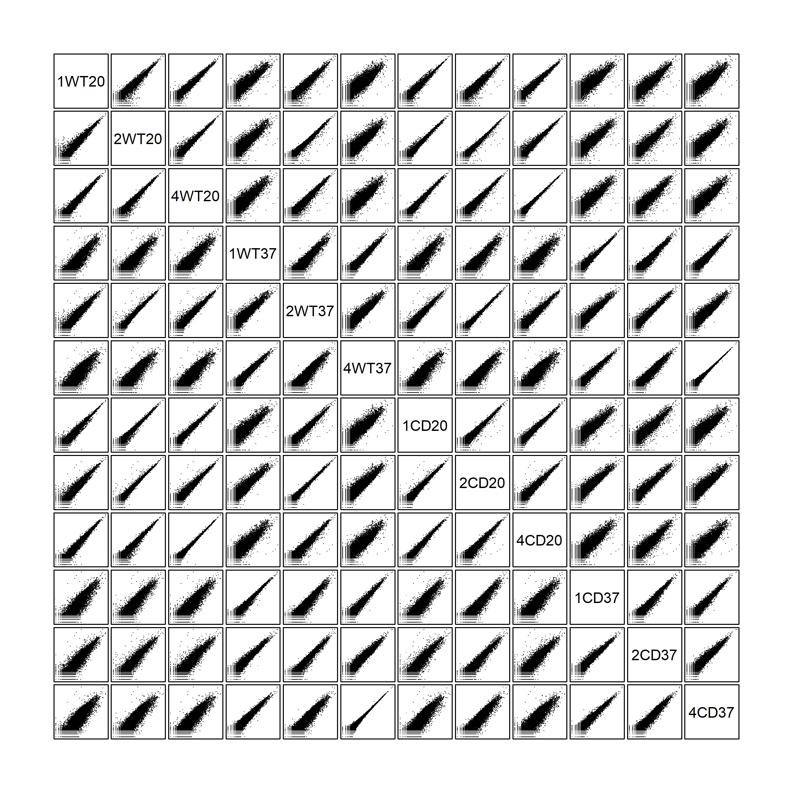

# Transcriptome and Ribosome profiling analysis

**Prerequisites:**  
[cutadapt 1.18](https://cutadapt.readthedocs.io/en/stable/index.html)  
[STAR-2.6.1d](https://github.com/alexdobin/STAR)  
[gffread utility](http://ccb.jhu.edu/software/stringtie/gff.shtml)  
Transcriptome samples were sequenced in paired-end 150 nt mode on Illumina sequencer.
Ribosome profiling samples were prepared with Illumina Small RNA TruSeq kit and sequenced in single-end 50 nt mode on Illumina sequencer.
Raw sequencing files are available from [GEO]().


### Preparing genome annotation and index files
C. elegans genomic sequences and annotation files (WS268) were downloaded from the [Wormbase](https://wormbase.org/).

| files                                       | MD5 check sum (unzipped)         | Description              |
| ------------------------------------------- |:--------------------------------:| -------------------------|
| c_elegans.PRJNA13758.WS268.annotations.gff3 | 2b353175bf6e8410815aede3a77a8a62 | annotation               |
| c_elegans.PRJNA13758.WS268.genomic.fa       | d570defcdc006a7c2859fc92dbb21bc4 | Genome sequence          |

<details><summary><b>Prepare custom genomic annotation</b></summary>
Keep only 'Wormbase' feature types for C. elegans (manually curated). Discard other types (usually predicted or related to other nematode species). Drop annotation of non-coding features such as miRNA and pseudogenes.
 
```R
library(data.table)
library(magrittr)
library(rstudioapi)
library(stringr)
setwd(dirname(getActiveDocumentContext()$path))

#------------------------------------------ Define some useful functions -------------------------------------------------------------
# creates a 2-column table with children->parent linkages. Takes original gff annotation as its argument.
linkage <- function(gff) { 
  output <- apply(gff, 1, function(x) {
     type   <- x[3]
     id     <- str_match(x[9], 'ID=([^;]+)')[[2]]
     parent <- str_match(x[9], 'Parent=([^;,]+)')[[2]]
     return(c(type, id, parent))
  })
  
  output <- t(output)
  colnames(output) <- c('Type', 'ID', 'Parent')
  output[is.na(output[, 'Parent']), 'Parent'] <- 'Primary'
  
  # sometimes feature have no ID. In that case generate a unique ID as 'generatedID' + [line number]
  extendedID <- sapply(1:nrow(output), function(x) {
            if(is.na(output[x, 'ID'])) { new_id <- paste0('generatedID_',x); return(new_id)}
            else {return(output[x, 'ID'])}
  })
  
  output <- data.table('type' = output[, 'Type'], 'ID' = extendedID, 'Parent' = output[, 'Parent'], 'status' = rep('keep', nrow(output)), stringsAsFactors = FALSE)
  return(output)
}

removeFeatures <- function(gff, parentsTable, featureType){
  #find a top parent (usually a gene name) of every feature you want to remove
  topParents <- c() 
  features <- parentsTable[featureType, on = 'type', ID]
  while(TRUE) {
    candidates <- parentsTable[features, on = 'ID', Parent]
    topParents <- union(topParents, features[candidates == 'Primary'])
    candidates <- candidates[candidates != 'Primary' & !is.na(candidates)]
    if(length(candidates) == 0) { break }
    features   <- parentsTable[candidates, on = 'ID', ID]
  }
  
  # remove all children of the corresponding top parents
  parentsTable[topParents, on = 'ID', status := 'remove']
  children  <- parentsTable[topParents, on = 'Parent', ID]
  while(length(children) > 0) {
    parentsTable[children, on = 'ID', status := 'remove']
    children <- parentsTable[parentsTable$Parent %in% children, ID]
  }
  
  annotation <- gff[parentsTable[, status] %in% 'keep', ]
  return(annotation)
}
#-------------------------------------------------------------------------------------------------------------------------------------
# Load GFF annotation file
gff  <- fread(file="../Original/c_elegans.PRJNA13758.WS268.annotations.gff3", skip = 8, stringsAsFactors = F, header = F, fill = T, na.strings = c("", "NA"), sep="\t") %>% na.omit() #deals with unwanted #comment lines in the gff
gff  <- gff[grepl('ID=|Parent=', gff$V9), ]  # discard feature with no ID in the attributes field. These are typically things like SNPs, TF-binding sites and other genomic features.
gff  <- gff[gff$V2 == 'WormBase', ]          # discard predictions and non-curated junk

# con <- file("../Original/c_elegans.PRJNA13758.WS268.annotations.gff3", "r")
# header <- readLines(con, n = 8)
# write.table(header, file = "Wormbase.gff", col.names = F, row.names = F, quote = F)
# write.table(gff, file = "Wormbase.gff", sep = "\t", row.names = F, col.names = F, quote = F, append = T)
# close(con); rm(con)

parentsTable <- linkage(gff)
setindex(parentsTable, 'ID')
setindex(parentsTable, 'Parent')
setindex(parentsTable, 'type')

# Remove non-coding features
gff2 <- removeFeatures(gff, featureType = c( 'antisense_RNA','nc_primary_transcript','snRNA','lincRNA','ncRNA','tRNA','pre_miRNA','miRNA','scRNA','snoRNA', 'pseudogenic_tRNA', 'piRNA', 'pseudogenic_transcript', 'pseudogenic_rRNA','rRNA'), parentsTable = parentsTable)

# con <- file("../Original/c_elegans.PRJNA13758.WS268.annotations.gff3", "r")
# header <- readLines(con, n = 8)
# write.table(header, file = "WS268_Wormbase_coding.gff3", col.names = F, row.names = F, quote = F)
# write.table(gff2, file = "WS268_Wormbase_coding.gff3", sep = "\t", row.names = F, col.names = F, quote = F, append = T)
# close(con); rm(con)
```
</details>

<details><summary><b>Convert annotation from GFF3 to GTF format</b></summary>  
     
```bash
gffread WS268_Wormbase_coding.gff3 -T -o WS268_Wormbase_coding.gtf
# -T          - convert gff/gtf
```
</details>

<details><summary><b>Building genomic and rDNA index files</b></summary>
  
```bash  
# rDNA indexing for Bowtie
bowtie-build Elegans_rRNA.fa ./Elegans_indices/Elegans_rRNA  
# Genome indexing for STAR
STAR --runThreadN 40 --runMode genomeGenerate --genomeDir ./Elegans_index/ --genomeFastaFiles ./c_elegans.PRJNA13758.WS268.genomic.fa --sjdbGTFfile ./WS268_Wormbase_coding.gtf
```
</details>

### Ribo-seq sequencing reads filtering and mapping   
<details><summary><b>Illumina adapter trimming.</b></summary>

```bash
cutadapt -j 20 -m 23 -a TGGAATTCTCGGGTGCCAAGG -o out.fastq input.fq.gz 
# -j      - number of threads
# -m      - discard reads shorter than 23 nucleotides after adapter trimming
```
</details>

<details><summary><b>Discard reads mapping to rRNA and PhiX</b></summary>
  
```bash
bowtie -p 36 --un filtered.fastq ./bowtie-1.2.1.1/Elegans_indices/Elegans_rRNA trimmed.fastq >/dev/null
```
</details>

<details><summary><b>Ribo-seq Sequencing Summary Statistics</b></summary>

|   sample   | total number of reads  |   rRNA + PhiX [%]  | footprints (first sequencing) | footprints (second sequencing) |
|:---------: |:----------------------:|:------------------:|:-----------------------------:|:------------------------------:|
|1WT20       |  29931496              |   25.51            |  22296445                     |  0                             |
|2WT20       |  26428417              |   41.50            |  15460677                     |  0                             |
|4WT20       |  22083711              |   23.88            |  16809424                     |  0                             |
|1WT37       |  18893098              |   91.37            |  1630864                      |  7563889                       |
|2WT37       |  27558119              |   50.91            |  13528926                     |  0                             |
|4WT37       |  18328652              |   50.20            |  9126816                      |  0                             |
|1CD20       |  31528904              |   29.90            |  22101589                     |  0                             |
|2CD20       |  26507787              |   46.05            |  14300563                     |  0                             |
|4CD20       |  18448868              |   25.54            |  13737481                     |  0                             |
|1CD37       |  15408038              |   60.19            |  6134583                      |  0                             |
|2CD37       |  21317358              |   59.35            |  8664500                      |  0                             |
|4CD37       |  16801168              |   57.87            |  7078945                      |  0                             |



First round of sequencing revealed that sample 1WT37 yeilded low number of ribosomal footprints. Therefore, we re-sequenced this sample to increase the coverage.   


</details>

<details><summary><b>Read mapping and counting with STAR</b></summary>
     
```bash
STAR --genomeLoad LoadAndExit --genomeDir ../STAR-2.6.1d/Elegans_index/ 	# load genome once in the shared memory
STAR --runThreadN 40 --outSAMtype BAM Unsorted --outSAMmultNmax 1 --quantMode GeneCounts TranscriptomeSAM --genomeLoad LoadAndKeep --genomeDir ../STAR-2.6.1d/Elegans_index/ --readFilesIn filtered.fastq --outFileNamePrefix ./OUT_folder 
STAR --genomeLoad Remove 	# remove loaded genome from shared memory
# ipcs - check shared memory consumption
# ipcrm - remove object from shared memory
```
</details>

### mRNA-seq sequencing reads filtering and mapping   
<details><summary><b>Illumina adapters trimming</b></summary>

```bash
cutadapt -j 20 -m 75 -a AGATCGGAAGAGCACACGTCTGAACTCCAGTCAC -A AGATCGGAAGAGCGTCGTGTAGGGAAAGAGTGTAGATCTCGGTGGTCGCCGTATCATT -o trimmed_1.fq.gz -p trimmed_2.fq.gz read.1.fq.gz read.2.fq.gz
# -j      - number of threads
# -m      - discard read pair if any of the mates if shorter than 75 nucleotides after adapter trimming
```
</details>

<details><summary><b>Read mapping and counting with STAR</b></summary>
     
```bash
STAR --genomeLoad LoadAndExit --genomeDir ../STAR-2.6.1d/Elegans_index/ 	# load genome once in the shared memory
STAR --runThreadN 40 --outSAMtype BAM Unsorted --outSAMmultNmax 1 --quantMode GeneCounts --genomeLoad LoadAndKeep --genomeDir ../STAR-2.6.1d/Elegans_index/ --readFilesCommand gunzip -c --readFilesIn trimmed_1.fastq trimmed_2.fastq --outFileNamePrefix ./OUT_folder 
STAR --genomeLoad Remove 	# remove loaded genome from shared memory
# ipcs - check shared memory consumption
# ipcrm - remove object from shared memory
```
</details>


### Sample clustering, quality checks  
Code is available in **DataAnalysis.R** script  
<details><summary><b>mRNA-seq scatterplots</b></summary> 
     
</details>

<details><summary><b>Ribo-seq scatterplots</b></summary> 
     
</details>

<details><summary><b>Principal component analysis</b></summary>
 
mRNA-seq on the left and Ribo-seq on the right. Samples are separated into 2 clusters by the temperature, but they are not searated by the strain. Subsequent DE analysis indentifies only 9 genes different between the WT and CD strains.  
Gene expression was modelled as ~ b0 + b1\*strain + b2\*temperature + b3\*strain\*temperature  
None of the genes had a significant outcome in the interaction term. *Conclusion:* there are no statistically significant genes that are differentially expressed between strains when controlled for the temperature.   


 
</details>

<details><summary><b>Sample Clustering Heatmaps</b></summary>
 
mRNA-seq on the left and Ribo-seq on the right.  

 
     
</details>

<details><summary><b>Genes Clustering Heatmaps</b></summary>
 
mRNA-seq on the left and Ribo-seq on the right.   

 
    
</details>
